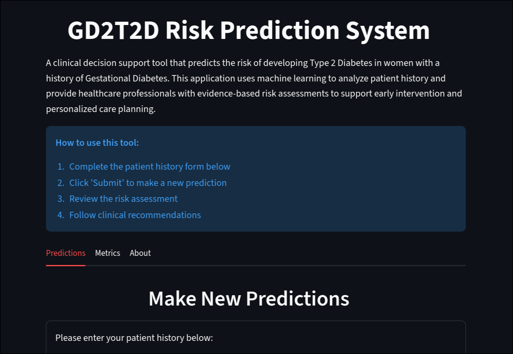

# Gestational Diabetes to Type 2 Diabetes Risk Prediction App
[](https://gd2t2d-risk.onrender.com)
## Problem Overview

This project explores predicting risk of Type 2 diabetes in women with a history of gestational diabetes. According to Dennison et al (2020), 33% of women who suffered with gestational diabetes will also develop type II diabetes within 15 years. Being able to reliably and explainably predict at risk patients allows for health services to take a proactive action. 

### The Dataset

This dataset is from the aforementioned study by Prashanthan and Prashanthan (2025). Following this, the data was uploaded to Kaggle.

Original dataset: [Data for T2DM Risk prediction after GDM](https://www.kaggle.com/datasets/prashanthana/gdm-risk-data-for-t2dm-prediction/data)
Original study paper: [Predicting the future risk of developing type 2 diabetes in women with a history of gestational diabetes mellitus using machine learning and explainable artificial intelligence](https://www.primary-care-diabetes.com/article/S1751-9918(25)00191-3/abstract)

### Project Approach

To summarise the steps taken in this project:
- EDA: Explore the dataset, the feature and class distribution and discover feature importance
- Model building and finetuning: Testing Decision Trees, Random Forest and XGBoost models to see which model performed well while minimising Type II errors
- Selecting the best model based on evaluation metrics and use case
- Serialisng the model using pickle to be later deployed
- FastAPI Service: Serve predictions following the pipeline product of best model
- Containerisation of FastAPI Service: To allow for easy deployment.

### Project Structure

To understand how this project is organised, please find a breakdown of how this repository is structured [here](./assets/file_structure.md).


## Running this project

This project provides a machine-learning prediction app for estimating the risk of progression from Gestational Diabetes Mellitus (GDM) to Type 2 Diabetes Mellitus (T2DM).
It includes:

- A training pipeline (offline model building)
- A FastAPI inference service (real-time predictions)
- A fully containerized deployment using Docker
- Streamlit Frontend application to make new predictions

> *Prerequisites*
> Please ensure you have UV installed. 
> Installation instructions can be found here: https://docs.astral.sh/uv/getting-started/installation/

### Using Deployed API Service

As this endpoint has been deployed using Render, you can visit the following url to test the endpoint:

https://gd2t2d-risk.onrender.com/

As this is a free deployment resource, it will take time for the service to load (around 1min).

### Local inference (Docker)

Alternatively you can run the service using docker on your PC. This will require Docker Engine to be installed on your computer.

1. Clone the repository

```bash
git clone https://github.com/swilldd/gd2t2d-risk.git
cd gd2t2d-risk
```

2. Set up local environment
Run the following command in your terminal
```bash
uv sync
```

3. Build the multi-container docker image
Run the following command to build the docker image:
```bash
docker-compose up --build -d
```

Now you can access the service by following the link: http://localhost:8501


## Deployed Model Summary

- Algorithm: Random Forest Classifier
- Vectorization: DictVectorizer
- Evaluation metrics: AUC, Recall, Precision, F1
- Prioritizes minimizing false negatives (Type II error) due to clinical risk.


## How did we measure success?

This problem was explored by Prashanthan and Prashanthan (2025) in a study where they managed to acheive the following metrics using an AdaBoost classifier:

- Accuracy - 0.89
- Precision - 0.74
- Recall - 0.88
- F1 score - 0.80

This project aimed to replicate this performance or better, whilst minimising Type II errors (false negatives) which would lead to support not being directed to mothers that need it the most.

This was acheived with the final model acheiving the following metrics:


More detail can be found [here](./notebooks/02_model_building.ipynb).

## Future Feature Enhancements

*Testing other explainable ML models*
The original paper found AdaBoost to be the best model, which I have yet to test due to time constraints. In the future I would like to test this model and compare with my best model at present. 

*Visualise feature importances*
Whilst at some level feature importances were explored, giving the importance of the the model decision explaiability, it would be beneficial to visualise these importances.

*Continued Streamlit Dashboard Development*
For real life application, a dashboard that allows the user to take the following actions would need to be implemented:
- Visualise the features that contributed most to the individual prediction
- Show relevant KPIs


